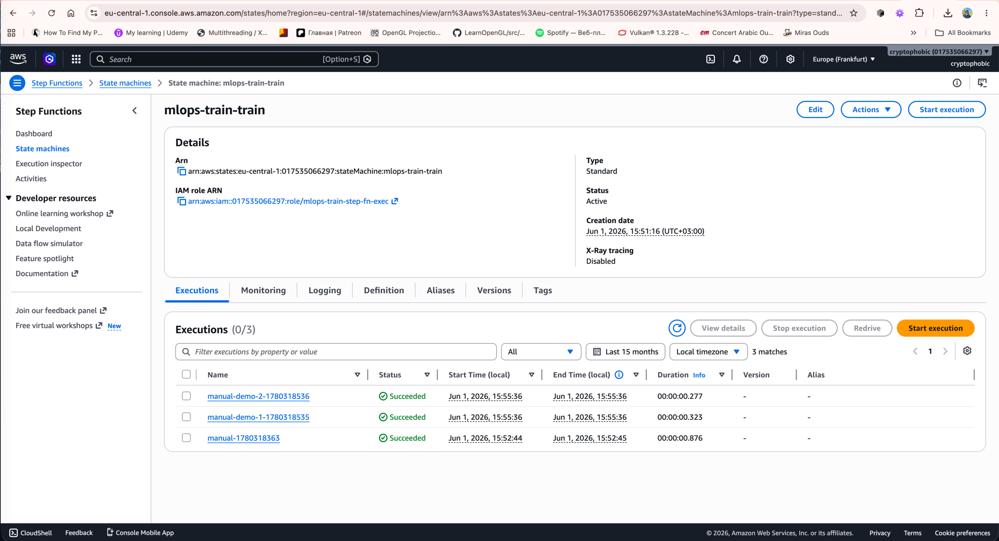
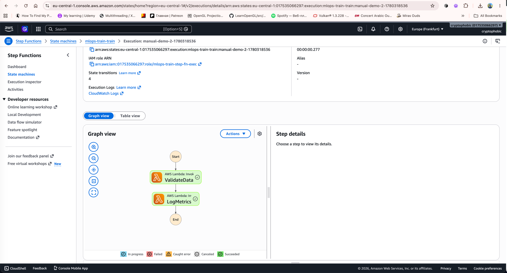
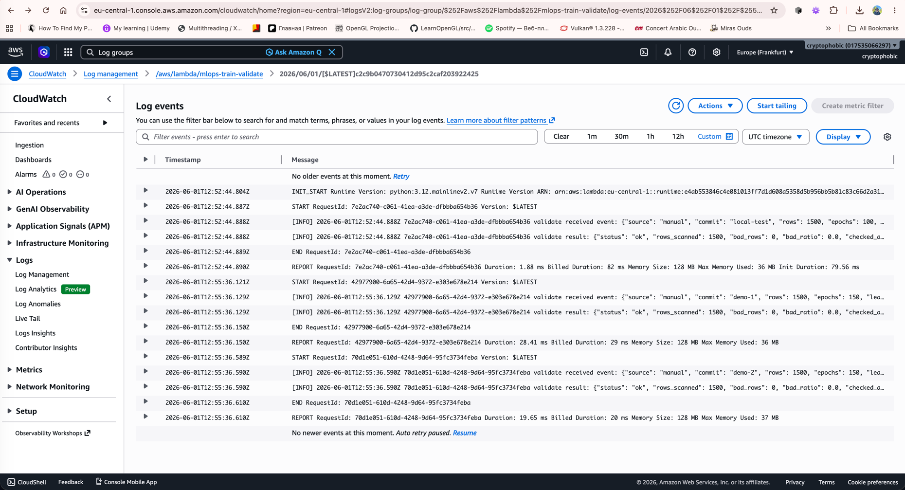
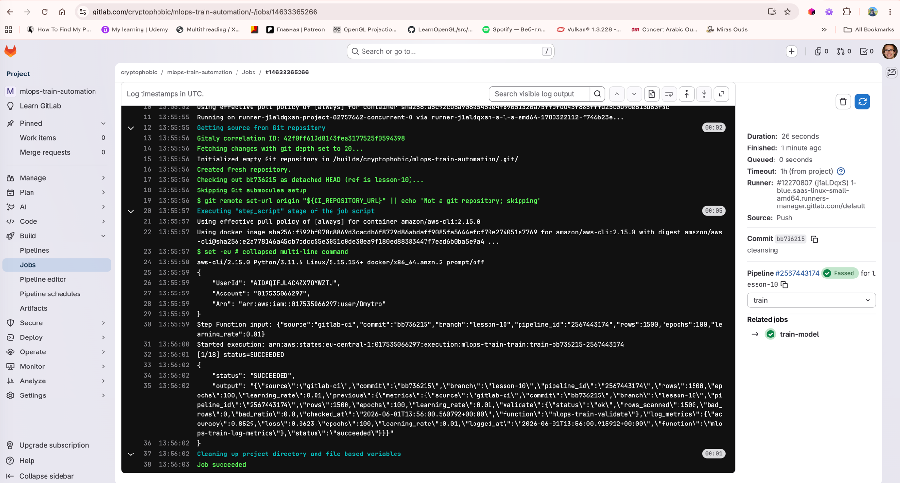

# Лог виконання (proof) — lesson-10

Реальні CLI-виводи. Регіон `eu-central-1`, аккаунт `017535066297`.

## 1. terraform apply

```bash
cryptophobic@Mac terraform % terraform init
# ...
Terraform has been successfully initialized!

cryptophobic@Mac terraform % terraform apply -auto-approve
# ...
Apply complete! Resources: 10 added, 0 changed, 0 destroyed.

Outputs:
log_metrics_lambda_name = "mlops-train-log-metrics"
manual_start_command    = "aws stepfunctions start-execution --region eu-central-1 --state-machine-arn arn:aws:states:eu-central-1:017535066297:stateMachine:mlops-train-train --name manual-$(date +%s) --input '{\"source\":\"manual\",\"commit\":\"local-test\",\"rows\":1500}'"
state_machine_arn       = "arn:aws:states:eu-central-1:017535066297:stateMachine:mlops-train-train"
state_machine_name      = "mlops-train-train"
validate_lambda_name    = "mlops-train-validate"
```

## 2. Manual exec

```bash
cryptophobic@Mac terraform % SM_ARN=$(terraform output -raw state_machine_arn)
cryptophobic@Mac terraform % aws stepfunctions start-execution \
    --region eu-central-1 \
    --state-machine-arn "$SM_ARN" \
    --name "manual-$(date +%s)" \
    --input '{"source":"manual","commit":"local-test","rows":1500,"epochs":100,"learning_rate":0.01}'
{
    "executionArn": "arn:aws:states:eu-central-1:017535066297:execution:mlops-train-train:manual-1780318363",
    "startDate": "2026-06-01T15:52:44.524000+03:00"
}
```

## 3. Виконання SUCCEEDED

```bash
cryptophobic@Mac terraform % aws stepfunctions describe-execution \
    --region eu-central-1 \
    --execution-arn arn:aws:states:eu-central-1:017535066297:execution:mlops-train-train:manual-1780318363
{
    "status": "SUCCEEDED",
    "startDate": "2026-06-01T15:52:44.524000+03:00",
    "stopDate":  "2026-06-01T15:52:45.400000+03:00",
    "output": {
        "source": "manual",
        "commit": "local-test",
        "rows": 1500,
        "epochs": 100,
        "learning_rate": 0.01,
        "previous": {
            "metrics": {
                "validate": {
                    "status": "ok",
                    "rows_scanned": 1500,
                    "bad_rows": 0,
                    "bad_ratio": 0.0,
                    "checked_at": "2026-06-01T12:52:44.888428+00:00",
                    "function": "mlops-train-validate"
                },
                "log_metrics": {
                    "accuracy": 0.9553,
                    "loss": 0.1244,
                    "epochs": 100,
                    "learning_rate": 0.01,
                    "logged_at": "2026-06-01T12:52:45.334776+00:00",
                    "function": "mlops-train-log-metrics"
                },
                "status": "succeeded"
            }
        }
    }
}
```

## 4. Три execution-и підряд

```bash
cryptophobic@Mac terraform % aws stepfunctions list-executions --region eu-central-1 \
    --state-machine-arn "$SM_ARN" --max-items 5 \
    --query 'executions[].{name:name,status:status,start:startDate}'
[
    { "name": "manual-demo-2-1780318536", "status": "SUCCEEDED", "start": "2026-06-01T15:55:36.479000+03:00" },
    { "name": "manual-demo-1-1780318535", "status": "SUCCEEDED", "start": "2026-06-01T15:55:36.005000+03:00" },
    { "name": "manual-1780318363",         "status": "SUCCEEDED", "start": "2026-06-01T15:52:44.524000+03:00" }
]
```





## 5. CloudWatch logs

Останній лог Lambda `mlops-train-validate`:

```text
INIT_START Runtime Version: python:3.12.v...
START RequestId: ...
[INFO] validate received event: {"source":"manual","commit":"local-test","rows":1500,...}
[INFO] validate result: {"status":"ok","rows_scanned":1500,"bad_rows":0,"bad_ratio":0.0,"checked_at":"2026-06-01T12:52:44.888428+00:00","function":"mlops-train-validate"}
END RequestId: ...
REPORT RequestId: ... Duration: 5.31 ms ...
```



## 6. GitLab CI



## 7. terraform destroy

```bash
cryptophobic@Mac terraform % terraform destroy -auto-approve
# ...
Destroy complete! Resources: 10 destroyed.
```
