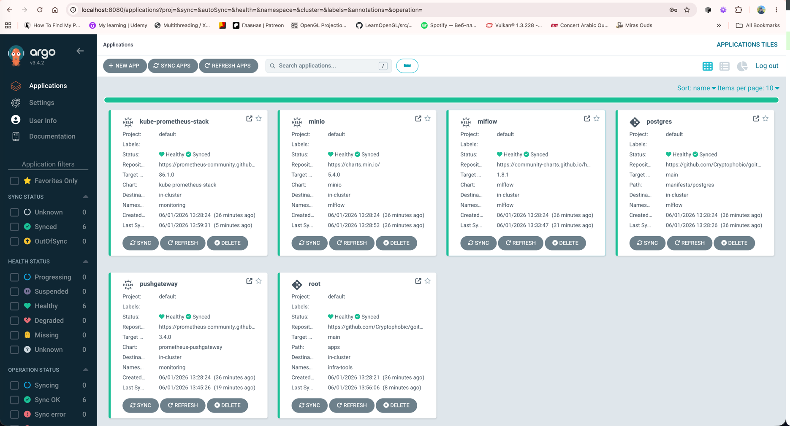
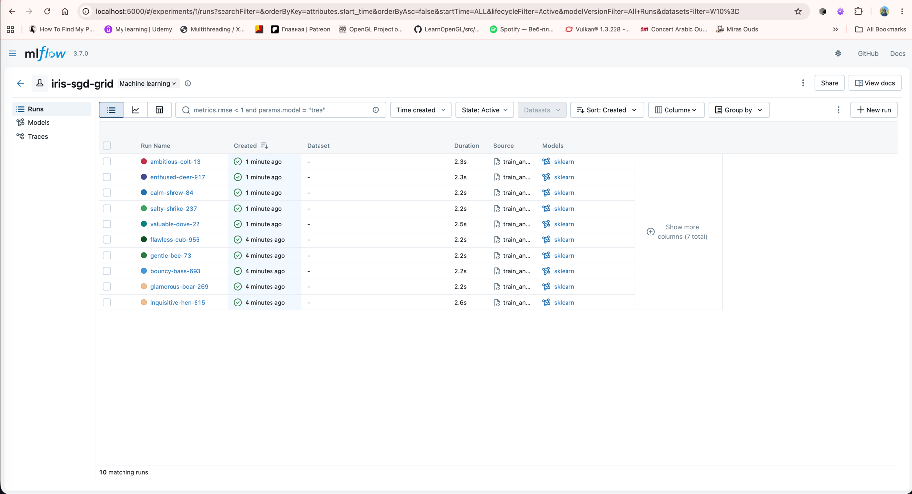
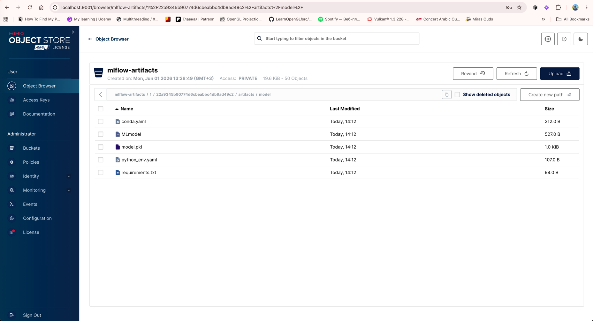
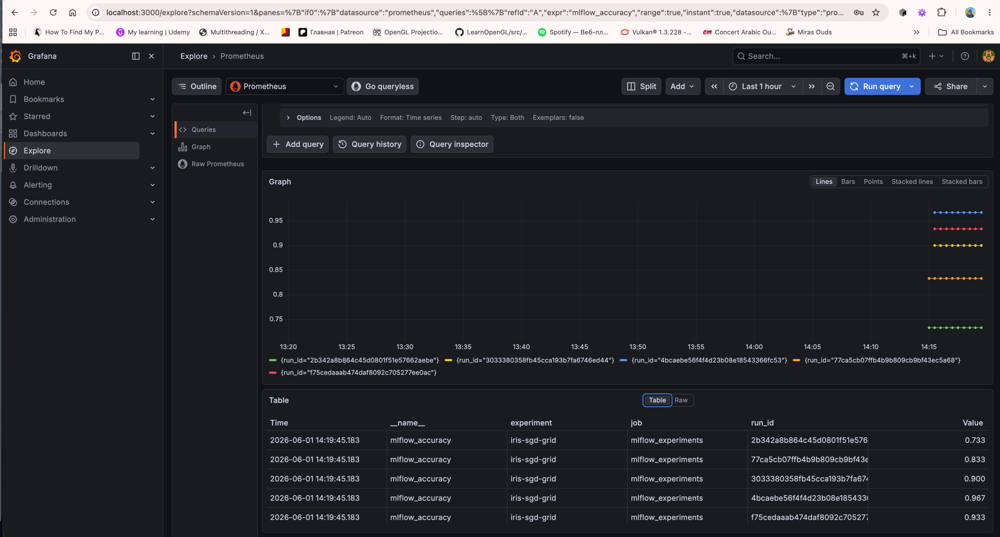
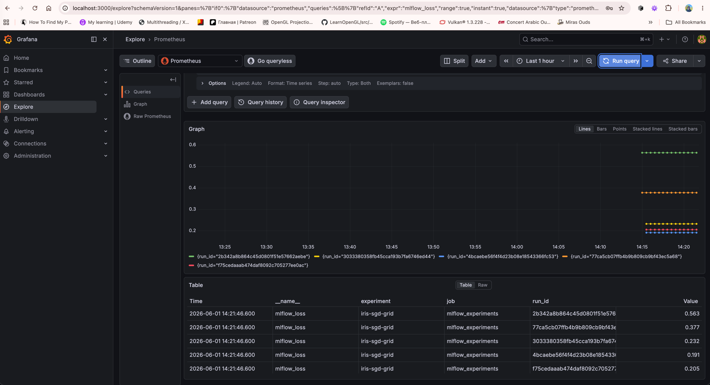

# Лог виконання (proof) — lesson-8-9

Реальні CLI-виводи з прогону. AWS account `017535066297`, region
`eu-central-1`, cluster `mlops-eks-cluster`.

## 1. Terraform apply — VPC + EKS

```bash
cryptophobic@Mac ML-OPS-CI-CD-classes % terraform apply -auto-approve
# ...
Apply complete! Resources: 71 added, 0 changed, 0 destroyed.

Outputs:
cluster_endpoint  = "https://A3630D594C90AFE48673511B90C4FB84.gr7.eu-central-1.eks.amazonaws.com"
cluster_name      = "mlops-eks-cluster"
region            = "eu-central-1"
vpc_id            = "vpc-0708ee4440762606a"
```

## 2. kubectl get nodes

```bash
cryptophobic@Mac ML-OPS-CI-CD-classes % aws eks update-kubeconfig --region eu-central-1 --name mlops-eks-cluster
Updated context arn:aws:eks:eu-central-1:017535066297:cluster/mlops-eks-cluster in ~/.kube/config

cryptophobic@Mac ML-OPS-CI-CD-classes % kubectl get nodes
NAME                                          STATUS   ROLES    AGE     VERSION
ip-10-0-0-48.eu-central-1.compute.internal    Ready    <none>   4m59s   v1.31.14-eks-3385e9b
ip-10-0-0-52.eu-central-1.compute.internal    Ready    <none>   2m53s   v1.31.14-eks-3385e9b
ip-10-0-1-198.eu-central-1.compute.internal   Ready    <none>   2m53s   v1.31.14-eks-3385e9b
ip-10-0-1-74.eu-central-1.compute.internal    Ready    <none>   4m44s   v1.31.14-eks-3385e9b
```

## 3. Terraform apply — ArgoCD layer

```bash
cryptophobic@Mac ML-OPS-CI-CD-classes % terraform -chdir=terraform/argocd apply -auto-approve
# ...
helm_release.argocd: Creation complete after 50s [id=argocd]
Apply complete! Resources: 2 added, 0 changed, 0 destroyed.

cryptophobic@Mac ML-OPS-CI-CD-classes % kubectl get pods -n infra-tools
NAME                                                READY   STATUS    RESTARTS   AGE
argocd-application-controller-0                     1/1     Running   0          102s
argocd-applicationset-controller-6fcb8d5d5b-lv8tt   1/1     Running   0          103s
argocd-redis-7d946bd8d4-w7j2c                       1/1     Running   0          103s
argocd-repo-server-67bf5b6c75-4htls                 1/1     Running   0          103s
argocd-server-67649fcc87-bftj7                      1/1     Running   0          103s
```

## 4. Bootstrap App-of-Apps

```bash
cryptophobic@Mac ML-OPS-CI-CD-classes % kubectl apply -n infra-tools -f argocd/root-app.yaml
application.argoproj.io/root created
```

## 5. ArgoCD applications — Synced / Healthy

```bash
cryptophobic@Mac ML-OPS-CI-CD-classes % kubectl get applications -n infra-tools
NAME                    SYNC STATUS   HEALTH STATUS
kube-prometheus-stack   Synced        Healthy
minio                   Synced        Healthy
mlflow                  Synced        Healthy
postgres                Synced        Healthy
pushgateway             Synced        Healthy
root                    Synced        Healthy
```

Скрін: 

## 6. Поди по namespace'ах

```bash
cryptophobic@Mac ML-OPS-CI-CD-classes % kubectl get pods -n mlflow
NAME                        READY   STATUS    RESTARTS   AGE
minio-8699d6bcd6-lqc97      1/1     Running   0          29m
mlflow-6cdcf8dd8f-j464l     1/1     Running   0          24m
postgres-5fd8568cb5-rz4xp   1/1     Running   0          29m

cryptophobic@Mac ML-OPS-CI-CD-classes % kubectl get pods -n monitoring
NAME                                                       READY   STATUS      RESTARTS   AGE
kube-prometheus-stack-grafana-575c45c46c-cq9fs             3/3     Running     0          1m
kube-prometheus-stack-kube-state-metrics-c7d86646c-6r7w8   1/1     Running     0          1m
kube-prometheus-stack-operator-68d99bfc4f-g4dt6            1/1     Running     0          1m
kube-prometheus-stack-prometheus-node-exporter-4b2jw       1/1     Running     0          1m
kube-prometheus-stack-prometheus-node-exporter-6gnv5       1/1     Running     0          1m
kube-prometheus-stack-prometheus-node-exporter-6rc2n       1/1     Running     0          1m
kube-prometheus-stack-prometheus-node-exporter-w6spm       1/1     Running     0          1m
prometheus-kube-prometheus-stack-prometheus-0              2/2     Running     0          1m
prometheus-pushgateway-d65df967c-fcbfs                     1/1     Running     0          12m
```

## 7. Запуск train_and_push.py

```bash
cryptophobic@Mac ML-OPS-CI-CD-classes % export MLFLOW_TRACKING_URI=http://localhost:5000
cryptophobic@Mac ML-OPS-CI-CD-classes % export MLFLOW_S3_ENDPOINT_URL=http://localhost:9000
cryptophobic@Mac ML-OPS-CI-CD-classes % export AWS_ACCESS_KEY_ID=mlflow
cryptophobic@Mac ML-OPS-CI-CD-classes % export AWS_SECRET_ACCESS_KEY=mlflow-secret-key
cryptophobic@Mac ML-OPS-CI-CD-classes % export AWS_DEFAULT_REGION=us-east-1
cryptophobic@Mac ML-OPS-CI-CD-classes % export PUSHGATEWAY_URL=http://localhost:9091
cryptophobic@Mac ML-OPS-CI-CD-classes % .venv/bin/python experiments/train_and_push.py
MLflow tracking URI: http://localhost:5000
run_id=2b342a8b864c45d0801f51e57662aebe  lr=0.001  epochs=50  accuracy=0.7333  loss=0.5634
run_id=77ca5cb07ffb4b9b809cb9bf43ec5a68  lr=0.01   epochs=50  accuracy=0.8333  loss=0.3771
run_id=3033380358fb44b9...                lr=0.05   epochs=100 accuracy=0.9000  loss=0.2319
run_id=f75cedaaab474daf8092c705277ee0ac  lr=0.1    epochs=100 accuracy=0.9333  loss=0.2053
run_id=4bcaebe56f4f4d23b08e18543366fc53  lr=0.3    epochs=200 accuracy=0.9667  loss=0.1913

BEST: run_id=4bcaebe56f4f4d23b08e18543366fc53  accuracy=0.9667  params={'learning_rate_init': 0.3, 'epochs': 200}
Best model artifacts saved to /Users/cryptophobic/PycharmProjects/ML-OPS-CI-CD-classes/best_model
```

Скрін: 

## 8. Артефакти у MinIO

Артефакти MLflow (модель + MLmodel + conda.yaml + requirements.txt) лежать у
бакеті `mlflow-artifacts`.

Скрін: 

## 9. PushGateway → Prometheus

```bash
cryptophobic@Mac ML-OPS-CI-CD-classes % curl -s http://localhost:9091/metrics | grep '^mlflow_'
mlflow_accuracy{experiment="iris-sgd-grid",instance="",job="mlflow_experiments",run_id="2b342a8b864c45d0801f51e57662aebe"} 0.7333
mlflow_accuracy{experiment="iris-sgd-grid",instance="",job="mlflow_experiments",run_id="77ca5cb07ffb4b9b809cb9bf43ec5a68"} 0.8333
mlflow_accuracy{experiment="iris-sgd-grid",instance="",job="mlflow_experiments",run_id="3033380358fb44b9..."}                0.9000
mlflow_accuracy{experiment="iris-sgd-grid",instance="",job="mlflow_experiments",run_id="f75cedaaab474daf8092c705277ee0ac"} 0.9333
mlflow_accuracy{experiment="iris-sgd-grid",instance="",job="mlflow_experiments",run_id="4bcaebe56f4f4d23b08e18543366fc53"} 0.9667
mlflow_loss{...} 0.5634
mlflow_loss{...} 0.3771
mlflow_loss{...} 0.2319
mlflow_loss{...} 0.2053
mlflow_loss{...} 0.1913
```

Prometheus підхопив таргет через `additionalScrapeConfigs`:

```bash
cryptophobic@Mac ML-OPS-CI-CD-classes % curl -s 'http://localhost:9090/api/v1/targets?state=active' | jq '.data.activeTargets[] | select(.scrapePool=="pushgateway")'
{
  "scrapePool": "pushgateway",
  "labels": { "job": "pushgateway" },
  "scrapeUrl": "http://prometheus-pushgateway.monitoring.svc.cluster.local:9091/metrics",
  "health": "up"
}

cryptophobic@Mac ML-OPS-CI-CD-classes % curl -s 'http://localhost:9090/api/v1/query?query=mlflow_accuracy' | jq '.data.result | length'
5
```

Скріни:
- 
- 

## 10. best_model/

```bash
cryptophobic@Mac ML-OPS-CI-CD-classes % cat best_model/BEST_RUN.txt
run_id=4bcaebe56f4f4d23b08e18543366fc53
accuracy=0.9667
loss=0.1913
params={'learning_rate_init': 0.3, 'epochs': 200}

cryptophobic@Mac ML-OPS-CI-CD-classes % ls best_model/model/
MLmodel         conda.yaml      model.pkl       python_env.yaml requirements.txt
```

## 11. terraform destroy

```bash
cryptophobic@Mac ML-OPS-CI-CD-classes % terraform -chdir=terraform/argocd destroy -auto-approve
# helm_release.argocd: Destroying...
# helm_release.argocd: Destruction complete after 30s
# kubernetes_namespace.infra_tools: Destruction complete after 10s
# Destroy complete! Resources: 2 destroyed.

cryptophobic@Mac ML-OPS-CI-CD-classes % terraform destroy -auto-approve
# ...
# Destroy complete! Resources: 71 destroyed.
```