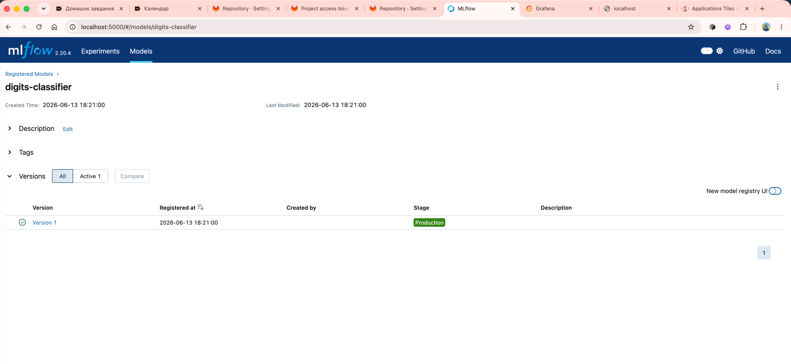
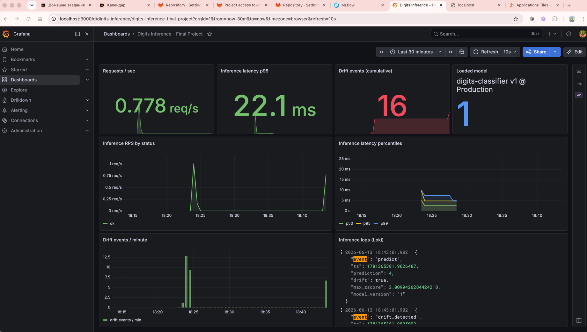
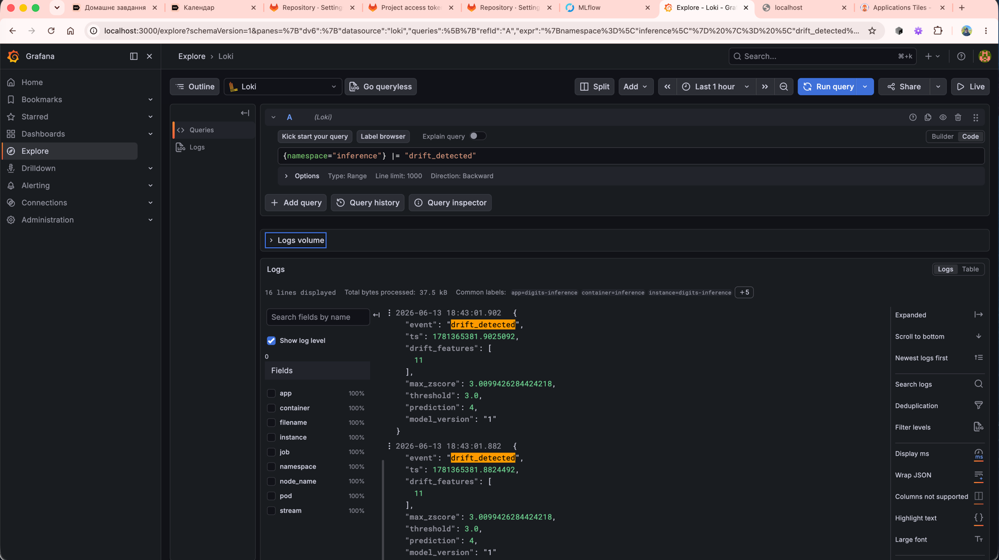

# Proof of work — Final Project

Усе нижче — реальний вивід команд із живого EKS-кластера
`mlops-eks-cluster` у `eu-central-1` (account `017535066297`),
розгорнутого терраформом цього репо, GitOps-частина з
[goit-argo](https://github.com/Cryptophobic/goit-argo).

## EKS кластер і ноди

```text
$ aws eks --region eu-central-1 update-kubeconfig --name mlops-eks-cluster
Updated context arn:aws:eks:eu-central-1:017535066297:cluster/mlops-eks-cluster

$ kubectl get nodes
NAME                                          STATUS   ROLES    AGE     VERSION
ip-10-0-1-191.eu-central-1.compute.internal   Ready    <none>   3h48m   v1.31.14-eks-3385e9b
ip-10-0-2-92.eu-central-1.compute.internal    Ready    <none>   3h48m   v1.31.14-eks-3385e9b
```

## ArgoCD Application-и (App-of-Apps)

10 Applications, всі **Synced/Healthy**:

```text
$ kubectl -n infra-tools get applications
NAME                       SYNC STATUS   HEALTH STATUS
digits-inference           Synced        Healthy
grafana-digits-dashboard   Synced        Healthy
grafana-loki-datasource    Synced        Healthy
kube-prometheus-stack      Synced        Healthy
loki                       Synced        Healthy
minio                      Synced        Healthy
mlflow                     Synced        Healthy
postgres                   Synced        Healthy
pushgateway                Synced        Healthy
root                       Synced        Healthy
```


## Pods за namespace-ами

```text
$ kubectl get pods -A | grep -vE "kube-system|kube-public"
inference   digits-inference-df6897496-tlxqr                          1/1  Running
inference   digits-train-926nm-rt9k8                                  0/1  Completed
infra-tools argocd-application-controller-0                           1/1  Running
infra-tools argocd-applicationset-controller-6fcb8d5d5b-v2lk4         1/1  Running
infra-tools argocd-redis-7d946bd8d4-ncf4d                             1/1  Running
infra-tools argocd-repo-server-6f6dbb69d5-f65dh                       1/1  Running
infra-tools argocd-server-67649fcc87-bs9z7                            1/1  Running
logging     loki-0                                                    1/1  Running
logging     loki-promtail-48sqh                                       1/1  Running
logging     loki-promtail-q5gcg                                       1/1  Running
mlflow      minio-8699d6bcd6-zc28v                                    1/1  Running
mlflow      mlflow-75b49f9976-5xs9q                                   1/1  Running
mlflow      postgres-5fd8568cb5-t7mpq                                 1/1  Running
monitoring  kube-prometheus-stack-grafana-575c45c46c-fpwrm            3/3  Running
monitoring  kube-prometheus-stack-kube-state-metrics-c7d86646c-hd8b8  1/1  Running
monitoring  kube-prometheus-stack-operator-68d99bfc4f-hk2s7           1/1  Running
monitoring  kube-prometheus-stack-prometheus-node-exporter-5ghqn      1/1  Running
monitoring  kube-prometheus-stack-prometheus-node-exporter-n6pdk      1/1  Running
monitoring  prometheus-kube-prometheus-stack-prometheus-0             2/2  Running
monitoring  prometheus-pushgateway-57f9655785-tbs59                   1/1  Running
```

## Train Job → MLflow Registry

Single Job (`digits-train-926nm`) запустився всередині кластера,
натренував LogisticRegression на sklearn-digits, залогував у MLflow,
зареєстрував модель і перемкнув її в `Production`:

```text
$ kubectl -n inference logs job/digits-train-926nm --tail=10
Successfully registered model 'digits-classifier'.
Created version '1' of model 'digits-classifier'.
run_id=95e1909d11e64ba08c77814fea31c122  accuracy=0.9722  loss=0.1020
🏃 View run gifted-midge-500 at: http://mlflow.mlflow.svc.cluster.local:5000/#/experiments/1/runs/95e1909d11e64ba08c77814fea31c122
Registered digits-classifier v1 → stage=Production
{"event": "training_completed", "model": "digits-classifier", "version": "1",
 "stage": "Production", "run_id": "95e1909d11e64ba08c77814fea31c122",
 "accuracy": 0.9722222222222222, "loss": 0.10195007619514311}
```




## FastAPI inference: /health, /predict, /predict (drift)

```text
$ kubectl -n inference port-forward svc/digits-inference 8000:80 &
$ curl -s http://localhost:8000/health | jq
{
  "status": "ok",
  "model_loaded": true,
  "model_version": "1"
}

$ # Нормальний predict (цифра 0 з sklearn-digits)
$ curl -s -X POST http://localhost:8000/predict -H 'Content-Type: application/json' \
    -d '{"features":[0,0,5,13,9,1,0,0,...,0,0,6,13,10,0,0,0]}' | jq
{
  "prediction": 0,
  "drift": false,
  "drift_features": [],
  "max_zscore": 1.8939809458807377,
  "model_version": "1",
  "model_stage": "Production"
}

$ # Drift predict (всі нулі — за межами baseline-розподілу)
$ curl -s -X POST http://localhost:8000/predict -H 'Content-Type: application/json' \
    -d '{"features":[0,0,0,...,0,0,0]}' | jq
{
  "prediction": 4,
  "drift": true,
  "drift_features": [11],
  "max_zscore": 3.0099426284424218,
  "model_version": "1",
  "model_stage": "Production"
}
```

## Prometheus метрики

Після `~50` запитів (40 нормальних + ~10 з дрейфом, потім ще burst):

```text
$ curl -s http://localhost:8000/metrics | grep -E "^inference"
inference_requests_total{status="ok"} 87.0
inference_drift_events_total 16.0
inference_model_version_info{model="digits-classifier",
  run_id="95e1909d11e64ba08c77814fea31c122",
  stage="Production",version="1"} 1.0
```

## Grafana дашборд

Custom dashboard `digits-inference` (з нашого `grafana/dashboards.json`,
auto-imported у Grafana через ConfigMap-sidecar KPS):



Панелі: Requests/sec, Inference latency p95, Drift events cumulative (16),
Loaded model (`digits-classifier v1 @ Production`), Inference RPS by status,
Inference latency percentiles (p50/p95/p99), Drift events/min, потік
JSON-логів з Loki.

## Loki: фільтр по drift подіях

```text
{namespace="inference"} |= "drift_detected"

16 lines displayed
Common labels: app=digits-inference container=inference instance=digits-inference

{
  "event": "drift_detected",
  "ts": 1781365381.9025092,
  "drift_features": [11],
  "max_zscore": 3.0099426284424218,
  "threshold": 3.0,
  "prediction": 4,
  "model_version": "1"
}
```

