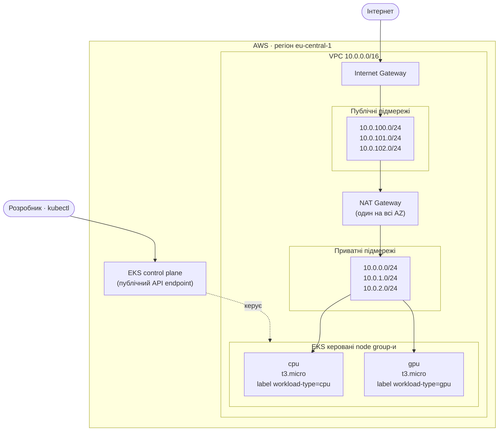
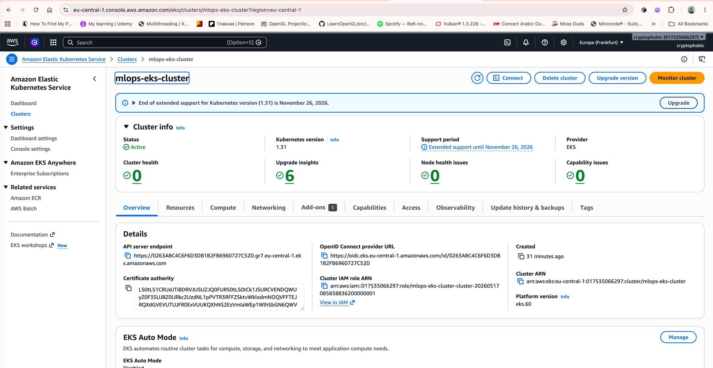
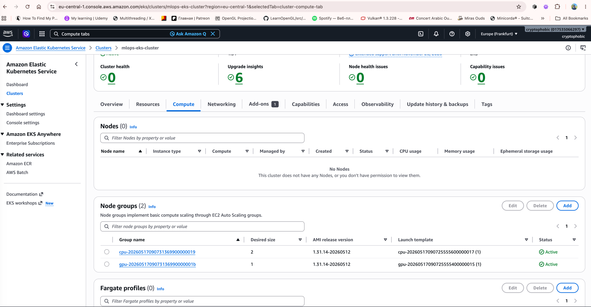

# Інфраструктура EKS + VPC (lesson-5-6)

Проєкт Terraform, що створює базову продакшн-інфраструктуру в AWS:

- **VPC** через офіційний модуль `terraform-aws-modules/vpc/aws`, та
- **EKS-кластер** із **двома керованими node group-ами** через офіційний
  модуль `terraform-aws-modules/eks/aws`.

Кореневий конфіг підключає обидва модулі як **локальні дочірні модулі**, тож
один `terraform apply` створює все, і кластер одразу доступний через `kubectl`.

## Архітектура



> Група `gpu` працює на Free-Tier `t3.micro`, як і група `cpu` — справжні
> GPU-інстанси не входять у Free Tier. Її лише **позначено** як GPU-пул
> (`workload-type=gpu`), щоб проєкт залишався безкоштовним для створення та
> перевірки.

## Структура репозиторію

```
.
├── main.tf            # викликає module "vpc" та module "eks"
├── variables.tf       # кореневі параметри (регіон, ім'я, cidr, версії, розміри)
├── outputs.tf         # vpc id, ім'я/endpoint кластера, команда kubectl
├── terraform.tf       # необхідні версії + aws provider
├── backend.tf         # локальний стейт (типово) + задокументований варіант S3
├── vpc/
│   ├── main.tf        # terraform-aws-modules/vpc/aws
│   ├── variables.tf
│   ├── outputs.tf
│   ├── terraform.tf
│   └── backend.tf
├── eks/
│   ├── main.tf        # terraform-aws-modules/eks/aws (2 node group-и)
│   ├── variables.tf
│   ├── outputs.tf
│   ├── terraform.tf
│   └── backend.tf
└── README.md
```

## Передумови

| Інструмент | Версія, використана під час створення |
| ---------- | ------------------------------------- |
| Terraform  | >= 1.5                                |
| AWS CLI    | v2                                    |
| kubectl    | v1.3x                                 |

- Облікові дані AWS з правами на створення VPC / EKS / IAM / EC2.
- Налаштуйте облікові дані одним зі способів:
  - `aws configure` (профіль за замовчуванням), або
  - `aws configure --profile <name>` + встановіть `aws_profile` (див. нижче), або
  - змінні середовища / IAM-роль.

## Конфігурація

Усі вхідні параметри мають розумні значення за замовчуванням у `variables.tf`,
тож файл `.tfvars` не потрібен. Поширені перевизначення:

| Змінна               | За замовчуванням | Призначення                                  |
| -------------------- | ---------------- | -------------------------------------------- |
| `aws_region`         | `eu-central-1`   | Регіон для розгортання                        |
| `aws_profile`        | `""`             | Іменований AWS-профіль (порожньо = типовий ланцюжок) |
| `project_name`       | `mlops-eks`      | Префікс імені для VPC + кластера              |
| `vpc_cidr`           | `10.0.0.0/16`    | CIDR VPC                                       |
| `cluster_version`    | `1.31`           | Версія Kubernetes для EKS                      |
| `node_instance_type` | `t3.micro`       | Тип інстансу node group (Free-Tier)            |
| `cpu_desired_size`   | `2`              | Кількість нод у групі `cpu`                    |
| `gpu_desired_size`   | `1`              | Кількість нод у групі `gpu`                    |

Перевизначення під час apply, напр.:

```bash
terraform apply -var="aws_profile=my-profile" -var="aws_region=eu-central-1"
```

## Використання

```bash
# 1. Ініціалізація (завантажує модулі vpc + eks та AWS provider)
terraform init

# 2. Перегляд плану
terraform plan

# 3. Створення всієї інфраструктури (~15-20 хв — EKS control plane + node group-и)
terraform apply
```

Після завершення `apply` Terraform виводить значення `configure_kubectl`.

### Підключення kubectl

```bash
aws eks --region eu-central-1 update-kubeconfig --name mlops-eks-cluster
kubectl get nodes
```

Ви маєте побачити ноди з **обох** node group-ів. Перевірте мітки:

```bash
kubectl get nodes --label-columns workload-type
```

## Лог виконання (докази)

Реальний прогін проєкту, регіон `eu-central-1`, дата `2026-05-17`.

### 1. `terraform apply` — успішно

```text
Apply complete! Resources: 71 added, 0 changed, 0 destroyed.

Outputs:

cluster_endpoint   = "https://0263ABC4C6F6D3DB1B2FB6960727C52D.gr7.eu-central-1.eks.amazonaws.com"
cluster_name       = "mlops-eks-cluster"
configure_kubectl  = "aws eks --region eu-central-1 update-kubeconfig --name mlops-eks-cluster"
node_group_names   = [
  "cpu",
  "gpu",
]
private_subnet_ids = [
  "subnet-01d7088e7f39c024c",
  "subnet-05921c3534271c6a6",
  "subnet-0f781b5546c61b958",
]
public_subnet_ids  = [
  "subnet-0f2ba65efef2f395c",
  "subnet-01a807f97ad65f8fc",
  "subnet-030c440982100cf19",
]
region             = "eu-central-1"
vpc_id             = "vpc-0d6ba3e3668f55a92"
```

### 2. Підключення kubectl

```text
$ aws eks --region eu-central-1 update-kubeconfig --name mlops-eks-cluster
Added new context arn:aws:eks:eu-central-1:...:cluster/mlops-eks-cluster to ~/.kube/config
```

### 3. `kubectl get nodes` — обидві node group-и `Ready`

```bash
cryptophobic@Mac ML-OPS-CI-CD-classes % kubectl get nodes --label-columns workload-type
NAME                                          STATUS   ROLES    AGE   VERSION                WORKLOAD-TYPE
ip-10-0-1-31.eu-central-1.compute.internal    Ready    <none>   28m   v1.31.14-eks-7fcd7ec   cpu
ip-10-0-2-182.eu-central-1.compute.internal   Ready    <none>   28m   v1.31.14-eks-7fcd7ec   cpu
ip-10-0-2-21.eu-central-1.compute.internal    Ready    <none>   28m   v1.31.14-eks-7fcd7ec   gpu
```

### 4. EKS-перевірка: 2 керовані node group-и, кластер ACTIVE

```text
$ aws eks list-nodegroups --cluster-name mlops-eks-cluster --region eu-central-1
{
    "nodegroups": [
        "cpu-20260517090731369900000019",
        "gpu-2026051709073136990000001b"
    ]
}

$ aws eks describe-cluster --name mlops-eks-cluster --region eu-central-1 \
      --query 'cluster.{name:name,status:status,version:version}' --output table
+--------------------+---------+-----------+
|        name        | status  |  version  |
+--------------------+---------+-----------+
|  mlops-eks-cluster |  ACTIVE |  1.31     |
+--------------------+---------+-----------+
```

### 5. AWS Console — кластер `mlops-eks-cluster`, Status: Active



### 6. AWS Console → Compute — дві node group-и `cpu` / `gpu`, Active



> ℹ️ Панель **Nodes (0)** у консолі — це обмеження доступу консолі (їй потрібен
> окремий EKS access entry для перегляду нод через браузер), а **не** проблема
> кластера. Авторитетне підтвердження нод — `kubectl get nodes` у пункті **3**
> (3 ноди `Ready`). Блок **Node groups (2)** вище підтверджує обидві керовані
> групи у стані `Active`.

> 📸 **Підсумок доказів:** `terraform apply` (п.1) + `kubectl get nodes` (п.3,
> текст) + AWS Console: кластер `Active` (п.5) та дві node group-и `Active`
> (п.6). Цього достатньо для критеріїв «робочий `terraform apply`», «кластер
> доступний через `kubectl`» та «EKS із двома node group-ами».

### Видалення (зробіть це після завершення — щоб уникнути рахунків AWS)

```bash
terraform destroy
```

## Стейт-бекенд

- **За замовчуванням: локальний стейт** (`terraform.tfstate` у цій директорії).
  Проєкт працює без попередніх налаштувань, і `terraform destroy` ніколи не
  зможе видалити бакет, що зберігає його власний стейт.
- **Опційно: S3-бекенд.** `backend.tf` містить готовий до розкоментування блок
  S3 та покрокову інструкцію. Створіть бакет **до** `terraform init` і тримайте
  його поза цим конфігом, щоб `destroy` ніколи не стер ваш стейт.