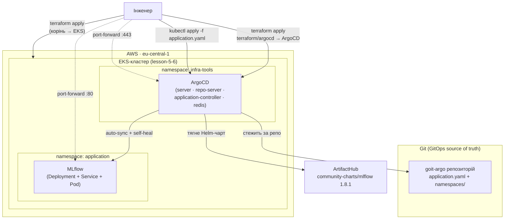

# GitOps на EKS: ArgoCD через Terraform + Helm-деплой MLflow (lesson-7)

Проєкт розгортає **ArgoCD** у вже створений EKS-кластер (з lesson-5-6) як
**Helm-реліз через Terraform**, а потім через **GitOps** автоматично деплоїть
тестовий застосунок **MLflow** з окремого Git-репозиторію
[`goit-argo`](https://github.com/Cryptophobic/goit-argo).

Стек складається з двох незалежних шарів Terraform:

| Шар | Каталог | Стейт | Що створює |
|-----|---------|-------|------------|
| Інфраструктура | корінь репо (`./`) | свій | VPC + EKS-кластер з 2 node group-ами |
| GitOps-платформа | `terraform/argocd/` | окремий | namespace `infra-tools` + ArgoCD (helm_release) |

Шари розділені навмисно: ArgoCD ставиться `helm`/`kubernetes`-провайдерами,
яким потрібен **живий** API-endpoint кластера. Окремий `apply` (спершу EKS,
потім ArgoCD) уникає проблеми «курка-яйце» першого запуску.

## Архітектура



## Структура репозиторію

```text
.
├── main.tf, variables.tf, outputs.tf, terraform.tf, backend.tf   # корінь: EKS + VPC
├── vpc/                  # модуль VPC (lesson-5-6)
├── eks/                  # модуль EKS (lesson-5-6)
├── terraform/
│   └── argocd/           # ▼ ШАР ARGOCD (lesson-7)
│       ├── main.tf            # kubernetes_namespace + helm_release argocd
│       ├── provider.tf        # aws + helm + kubernetes (через EKS data sources)
│       ├── variables.tf
│       ├── outputs.tf
│       ├── terraform.tf
│       ├── backend.tf
│       └── values/
│           └── argocd-values.yaml   # ClusterIP, extraArgs, rbac, timeouts
└── README.md
```

Маніфести застосунку (ArgoCD `Application` + namespaces) живуть в **окремому
публічному репозиторії** [`goit-argo`](https://github.com/Cryptophobic/goit-argo).

## Передумови

- AWS CLI з налаштованими креденшелами (`aws configure` або профіль/IAM-роль)
- Terraform >= 1.5
- `kubectl`
- Helm-провайдери Terraform тягнуться автоматично під час `init`

## Запуск

### Крок 1. EKS-кластер (корінь репо)

```bash
terraform init
terraform apply
# для щільності подів на маленьких нодах цей деплой піднімався на t3.small:
#   terraform apply -var node_instance_type=t3.small
```

Підключаємо `kubectl` до кластера:

```bash
aws eks --region eu-central-1 update-kubeconfig --name mlops-eks-cluster
kubectl get nodes
```

### Крок 2. ArgoCD (шар terraform/argocd)

```bash
cd terraform/argocd
terraform init
terraform apply        # за потреби: -var cluster_name=mlops-eks-cluster
```

Перевіряємо, що ArgoCD піднявся:

```bash
kubectl get pods -n infra-tools
```

Має бути кілька подів з префіксом `argocd-` у стані `Running`.

### Крок 3. Реєструємо Application (GitOps)

`application.yaml` лежить у репозиторії
[`goit-argo`](https://github.com/Cryptophobic/goit-argo). Зареєструйте його в
кластері один раз — далі ArgoCD сам синхронізує деплой:

```bash
kubectl apply -f application.yaml      # з клону goit-argo
kubectl get applications -n infra-tools
```

## Доступ до ArgoCD UI

```bash
# логін admin, пароль — з автогенерованого секрету:
kubectl -n infra-tools get secret argocd-initial-admin-secret \
  -o jsonpath='{.data.password}' | base64 -d; echo

# відкриваємо UI:
kubectl port-forward svc/argocd-server -n infra-tools 8080:443
# браузер: http://localhost:8080  (логін: admin)
# ArgoCD працює в insecure-режимі (server.insecure=true в argocd-values.yaml),
# тож UI віддається по HTTP — без TLS-редіректу при port-forward.
```

## Перевірка деплою

```bash
kubectl get applications -n infra-tools     # mlflow → Synced / Healthy
kubectl get pods,svc -n application         # под і сервіс MLflow
kubectl port-forward svc/mlflow -n application 5001:80
# браузер: http://localhost:5001  — UI MLflow
```

## Видалення

Спершу шар ArgoCD, потім кластер (зворотний порядок):

```bash
cd terraform/argocd && terraform destroy
cd ../.. && terraform destroy
```

## Посилання

- Репозиторій з `application.yaml`: <https://github.com/Cryptophobic/goit-argo>
- Helm-чарт ArgoCD: <https://artifacthub.io/packages/helm/argo/argo-cd>
- Helm-чарт MLflow: <https://artifacthub.io/packages/helm/community-charts/mlflow>

---

## Лог виконання (докази)

Усе нижче — реальний прогон у AWS (`eu-central-1`, акаунт `017535066297`),
кластер після перевірки знищено через `terraform destroy`.

### 1. EKS-кластер піднято (`terraform apply`, корінь)

```bash
cryptophobic@Mac ML-OPS-CI-CD-classes % terraform output
cluster_endpoint = "https://095E67D9C24957CDD7EC342026ED9CEC.gr7.eu-central-1.eks.amazonaws.com"
cluster_name = "mlops-eks-cluster"
configure_kubectl = "aws eks --region eu-central-1 update-kubeconfig --name mlops-eks-cluster"
node_group_names = [
  "cpu",
  "gpu",
]
region = "eu-central-1"
vpc_id = "vpc-07955049b7c37179b"

cryptophobic@Mac ML-OPS-CI-CD-classes % kubectl get nodes
NAME                                         STATUS   ROLES    AGE   VERSION
ip-10-0-0-97.eu-central-1.compute.internal   Ready    <none>   20m   v1.31.14-eks-3385e9b
ip-10-0-1-74.eu-central-1.compute.internal   Ready    <none>   20m   v1.31.14-eks-3385e9b
ip-10-0-2-22.eu-central-1.compute.internal   Ready    <none>   19m   v1.31.14-eks-3385e9b
```

### 2. ArgoCD розгорнуто через Terraform (`terraform/argocd`)

```bash
cryptophobic@Mac argocd % terraform apply -auto-approve
...
helm_release.argocd: Creation complete after 1m11s [id=argocd]
Apply complete! Resources: 2 added, 0 changed, 0 destroyed.

Outputs:
argocd_chart_version = "9.5.15"
argocd_namespace = "infra-tools"
argocd_release_name = "argocd"
argocd_server_service = "argocd-server"

cryptophobic@Mac ML-OPS-CI-CD-classes % kubectl get pods -n infra-tools
NAME                                                READY   STATUS    RESTARTS   AGE
argocd-application-controller-0                     1/1     Running   0          11m
argocd-applicationset-controller-6fcb8d5d5b-s9phn   1/1     Running   0          11m
argocd-redis-7d946bd8d4-78q77                       1/1     Running   0          11m
argocd-repo-server-67bf5b6c75-c4sj7                 1/1     Running   0          11m
argocd-server-67649fcc87-jc47n                      1/1     Running   0          11m
```

### 3. Application зареєстровано, ArgoCD синхронізував MLflow

```bash
cryptophobic@Mac ML-OPS-CI-CD-classes % kubectl apply -f goit-argo/application.yaml
application.argoproj.io/mlflow created

cryptophobic@Mac ML-OPS-CI-CD-classes % kubectl get applications -n infra-tools
NAME     SYNC STATUS   HEALTH STATUS
mlflow   Synced        Healthy

cryptophobic@Mac ML-OPS-CI-CD-classes % kubectl get pods,svc -n application
NAME                          READY   STATUS    RESTARTS   AGE
pod/mlflow-785fd89b5c-g6nz8   1/1     Running   0          2m19s

NAME             TYPE        CLUSTER-IP     EXTERNAL-IP   PORT(S)   AGE
service/mlflow   ClusterIP   172.20.35.72   <none>        80/TCP    8m45s
```

> Namespace `application` створено автоматично (`syncOptions: CreateNamespace=true`).

### 4. Доступ до сервісів через `port-forward`

MLflow:

```bash
cryptophobic@Mac ML-OPS-CI-CD-classes % kubectl port-forward svc/mlflow -n application 5001:80 &
cryptophobic@Mac ML-OPS-CI-CD-classes % curl -s -o /dev/null -w '%{http_code}\n' http://localhost:5001/health
200
cryptophobic@Mac ML-OPS-CI-CD-classes % curl -s http://localhost:5001/version
3.7.0
```

ArgoCD UI (insecure → HTTP):

```bash
cryptophobic@Mac ML-OPS-CI-CD-classes % kubectl port-forward svc/argocd-server -n infra-tools 8080:443 &
cryptophobic@Mac ML-OPS-CI-CD-classes % curl -s -o /dev/null -w '%{http_code}\n' http://localhost:8080/healthz
200
```

### 5. Прибирання (`terraform destroy`)

ArgoCD-шар знищено першим, потім кластер:

```bash
cryptophobic@Mac argocd % terraform destroy -auto-approve
Destroy complete! Resources: 2 destroyed.

cryptophobic@Mac ML-OPS-CI-CD-classes % terraform destroy -auto-approve
Destroy complete! Resources: 71 destroyed.

cryptophobic@Mac ML-OPS-CI-CD-classes % aws eks list-clusters --region eu-central-1
{
    "clusters": []
}
```

VPC проєкту, NAT-шлюзи та вільні EIP теж відсутні — білінг зупинено.