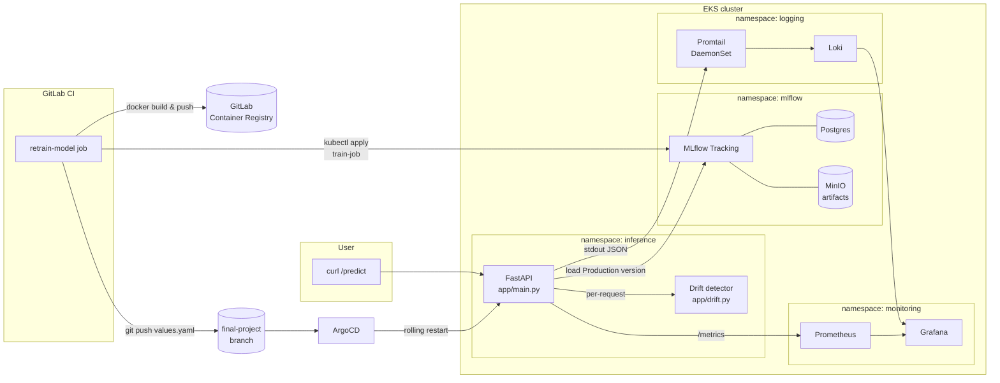

# Final Project — AIOps Quality Pipeline

Фінальний проєкт курсу: FastAPI inference-сервіс із drift-детектором,
розгорнутий на EKS через ArgoCD, з повним наглядом (Prometheus + Grafana
+ Loki + Promtail) та GitLab CI пайплайном для retrain-у моделі при
дрейфі вхідних даних.

Модель: `sklearn-digits` (LogisticRegression, 64 фічі, 10 класів). Усе
зберігання експериментів і артефактів — через MLflow (Postgres backend,
MinIO як S3 артифакторій), модель віддається з MLflow Model Registry
(стадія Production).

## Архітектура



## Структура репо

```
.
├── app/                          # FastAPI inference (image entrypoint)
│   ├── main.py                   # /predict, /metrics, /health
│   ├── drift.py                  # z-score drift detector
│   └── requirements.txt
├── model/                        # Тренування (та сама Docker image)
│   ├── train.py                  # sklearn digits → MLflow Registry
│   ├── train-job.yaml            # K8s Job, що його застосовує CI
│   └── requirements.txt
├── helm/                         # Чарт для inference-сервісу
│   ├── Chart.yaml
│   ├── values.yaml               # image.tag тут бампається у CI
│   └── templates/{deployment,service,servicemonitor,_helpers}
├── argocd/
│   └── application.yaml          # ArgoCD Application для helm/
├── grafana/
│   └── dashboards.json           # дашборд: RPS, latency, drift, logs
├── prometheus/
│   └── additionalScrapeConfigs.yaml  # fallback (основне — ServiceMonitor)
├── Dockerfile                    # python:3.12-slim, обидва entrypoint-и
├── .gitlab-ci.yml                # retrain-model pipeline
├── vpc/ eks/ terraform/argocd/   # Terraform: VPC + EKS + ArgoCD
└── *.tf                          # root: VPC + EKS модулі, AWS провайдер
```

Окремий GitOps-репозиторій
[goit-argo](https://github.com/Cryptophobic/goit-argo) тримає
App-of-Apps + усі Application маніфести (`mlflow`, `minio`, `postgres`,
`pushgateway`, `kube-prometheus-stack`, `loki`, `grafana-loki-datasource`,
`digits-inference`).

## Передумови

| Інструмент            | Версія                                                                 |
|-----------------------|-------------------------------------------------------------------------|
| Terraform             | >= 1.5                                                                 |
| AWS CLI               | v2 з повними правами на VPC/EKS/EC2 у `eu-central-1`                   |
| kubectl               | >= 1.31                                                                |
| Helm                  | v3 (для локальної валідації; у кластері все рендерить ArgoCD)          |
| Python                | 3.12 (для локального запуску FastAPI / train без кластера)             |

## Як запустити проєкт (live deploy)

### 1. Підняти EKS + bootstrap ArgoCD

```bash
# state — локальний (terraform.tfstate), нічого не треба готувати наперед.
terraform init
terraform apply -auto-approve

# Конфіг kubectl
aws eks update-kubeconfig --region eu-central-1 --name $(terraform output -raw cluster_name)
kubectl get nodes

# ArgoCD як helm_release вже задеплоєний модулем terraform/argocd.
# Перевірка:
kubectl -n infra-tools get pods
```

### 2. Активувати App-of-Apps (goit-argo)

```bash
# root-app дивиться на github.com/Cryptophobic/goit-argo:main, шлях apps/.
# Усі Application-и під apps/ підхопляться автоматично.
kubectl apply -n infra-tools -f /path/to/goit-argo/root-app.yaml

# Очікувані Application-и (Synced / Healthy):
#   postgres, minio, mlflow, pushgateway, kube-prometheus-stack,
#   loki, grafana-loki-datasource, digits-inference
kubectl -n infra-tools get applications
```

`digits-inference` зреференсить helm/-чарт у цьому репозиторії (гілка
`final-project`), розгорне його у namespace `inference`. Inference-под
не зможе піднятися, поки в MLflow Model Registry немає
`digits-classifier@Production` — спершу треба запустити перший train.

### 3. Перший train (seed моделі)

Запустити training Job вручну (CI робить це автоматично, але для
першого разу — самостійно):

```bash
TAG="seed-$(date +%s)"
# build & push image у будь-який registry (нижче — приклад для GitLab)
docker build -t registry.gitlab.com/<you>/ml-ops-ci-cd-classes/digits-inference:${TAG} .
docker push     registry.gitlab.com/<you>/ml-ops-ci-cd-classes/digits-inference:${TAG}

# Запуск train Job
sed "s|__IMAGE__|registry.gitlab.com/<you>/ml-ops-ci-cd-classes/digits-inference:${TAG}|g" \
    model/train-job.yaml | kubectl apply -f -

# Дочекатися завершення
kubectl -n inference wait --for=condition=complete --timeout=600s job -l app.kubernetes.io/name=digits-train

# Бампнути tag у values.yaml і закомітити
sed -i.bak "s|^  tag: .*|  tag: \"${TAG}\"|" helm/values.yaml && rm helm/values.yaml.bak
git add helm/values.yaml
git commit -m "seed: initial model image ${TAG}"
git push origin final-project
```

Після push-у ArgoCD синхронить, inference-под підніметься, /health
поверне `model_loaded: true`.

## Як протестувати запит

```bash
# Port-forward inference svc
kubectl -n inference port-forward svc/digits-inference 8000:80 &

# Sanity-check (модель завантажена)
curl -s http://localhost:8000/health | jq .

# Реальний приклад: цифра "0" з sklearn-digits (першиий sample,
# масштаб 0–16). Відповідь: prediction=0, drift=false.
curl -s -X POST http://localhost:8000/predict \
  -H 'Content-Type: application/json' \
  -d '{
    "features": [
      0,0,5,13,9,1,0,0,
      0,0,13,15,10,15,5,0,
      0,3,15,2,0,11,8,0,
      0,4,12,0,0,8,8,0,
      0,5,8,0,0,9,8,0,
      0,4,11,0,1,12,7,0,
      0,2,14,5,10,12,0,0,
      0,0,6,13,10,0,0,0
    ]
  }' | jq .
```

## Як перевірити логування

Кожен `/predict` дає JSON-рядок у stdout — Promtail зчитує
`/var/log/pods/inference_*/*` і пушить у Loki.

```bash
# Сирі логи з kubectl
kubectl -n inference logs -l app.kubernetes.io/name=digits-inference --tail=50

# Через Loki: port-forward Grafana і дивись на dashboard "Digits
# Inference - Final Project" → панель "Inference logs (Loki)"
kubectl -n monitoring port-forward svc/kube-prometheus-stack-grafana 3000:80 &
# креди: admin / prom-operator (default) або з secret kube-prometheus-stack-grafana
```

LogQL для прямого виклику в Explore:
```
{namespace="inference"} |= "event"
```

## Як перевірити спрацювання drift детектора

`DRIFT_THRESHOLD` за замовч. — 3.0 (max z-score per feature). Щоб
гарантовано тригернути дрейф, відправляємо вектор з усіма нулями
(деякі baseline-фічі мають std > 0, нуль буде поза 3σ для тих, що були
переважно ненульовими в тренувальному наборі):

```bash
# Усі 64 нулі — імітація аномального вхідного зображення
curl -s -X POST http://localhost:8000/predict \
  -H 'Content-Type: application/json' \
  -d "$(python -c 'import json; print(json.dumps({"features": [0.0]*64}))')" | jq .
```

Очікуєме:
- HTTP 200, `"drift": true`, `drift_features: [...]`, `max_zscore > 3.0`
- У логах: `{"event": "drift_detected", ...}` і явний рядок `Drift detected`
- У Prometheus: `inference_drift_events_total` збільшилось на 1
- У Grafana: панель "Drift events" блимнула

Прямо в kubectl:
```bash
kubectl -n inference logs -l app.kubernetes.io/name=digits-inference \
  | grep -E "drift_detected|Drift detected"
```

## Як перевірити, що retrain‑пайплайн працює

1. У GitLab → Settings → CI/CD → Variables додай:
   - `AWS_ACCESS_KEY_ID`, `AWS_SECRET_ACCESS_KEY` (Masked)
   - `AWS_REGION` (наприклад `eu-central-1`)
   - `EKS_CLUSTER_NAME` (з `terraform output cluster_name`)
   - `GITLAB_PUSH_TOKEN` — Project Access Token зі scope `write_repository` (Masked)
2. GitLab → Build → Pipelines → **Run pipeline** на гілці `final-project`.
3. У job-у `retrain-model` буде видно:
   - збірку нового образу і push у `${CI_REGISTRY_IMAGE}/digits-inference:<tag>`
   - `kubectl create -f` для train Job + `kubectl wait`
   - бамп `image.tag` у `helm/values.yaml` + commit + push
4. У MLflow UI зʼявиться новий run + нова `Version N` у Model Registry зі стадією Production.
5. ArgoCD підхоплює коміт у `final-project` → rolling restart deployment
   `digits-inference` → новий под завантажує свіжу версію.

## Як оновити модель

Дві опції:

**A) Через CI** (рекомендовано): як у попередньому розділі — `Run
pipeline`. Pipeline робить усе: train, bump image-tag, rolling restart.

**B) Вручну** (для відладки):
```bash
# Запустити train Job
TAG="manual-$(date +%s)"
docker build -t <registry>/digits-inference:${TAG} .
docker push     <registry>/digits-inference:${TAG}
sed "s|__IMAGE__|<registry>/digits-inference:${TAG}|g" \
  model/train-job.yaml | kubectl apply -f -
kubectl -n inference wait --for=condition=complete --timeout=600s job -l app.kubernetes.io/name=digits-train

# Якщо потрібен rolling restart inference (image lib не змінився):
kubectl -n inference rollout restart deployment/digits-inference
```

Стадія Production у MLflow Model Registry перемикається `train.py`
автоматично через `MlflowClient.transition_model_version_stage(...,
archive_existing_versions=True)`.

## Очистка

```bash
# Видалити Application-и (інакше finalizers заблочать teardown ArgoCD)
kubectl -n infra-tools delete applications --all

# Знести ArgoCD + ноду + VPC
terraform destroy -auto-approve
```

Якщо `terraform destroy` зависає на `Application` finalizer-ах — patch-ом
прибрати їх:
```bash
for a in $(kubectl -n infra-tools get applications -o name); do
  kubectl -n infra-tools patch $a --type merge \
    -p '{"metadata":{"finalizers":[]}}'
done
```

## Локальний smoke-test без кластера

```bash
python3.12 -m venv .venv && source .venv/bin/activate
pip install -r app/requirements.txt -r model/requirements.txt

# Підняти локальний MLflow (sqlite + локальний artifact dir)
mlflow server --host 127.0.0.1 --port 5000 \
  --backend-store-uri sqlite:///mlflow.db \
  --default-artifact-root ./mlruns &

export MLFLOW_TRACKING_URI=http://127.0.0.1:5000
python -m model.train               # seed модель + baseline

uvicorn app.main:app --port 8000    # стартує FastAPI з локальним MLflow
# /predict, /health, /metrics доступні на http://localhost:8000
```

## Критерії TASK.md → де реалізовано

| Критерій                       | Файл/директорія                               |
|--------------------------------|-----------------------------------------------|
| FastAPI з `predict()`          | `app/main.py` (функція `_predict`)            |
| Helm-чарт                      | `helm/`                                       |
| ArgoCD Application + auto-sync | `argocd/application.yaml`                     |
| Loki + Promtail (stdout)       | `goit-argo/apps/loki.yaml`                    |
| Prometheus + Grafana           | `kube-prometheus-stack` (goit-argo) + `grafana/dashboards.json` |
| Drift детектор                 | `app/drift.py` + `_emit("drift_detected")`    |
| GitLab CI retrain              | `.gitlab-ci.yml`                              |
| README                         | цей файл                                      |