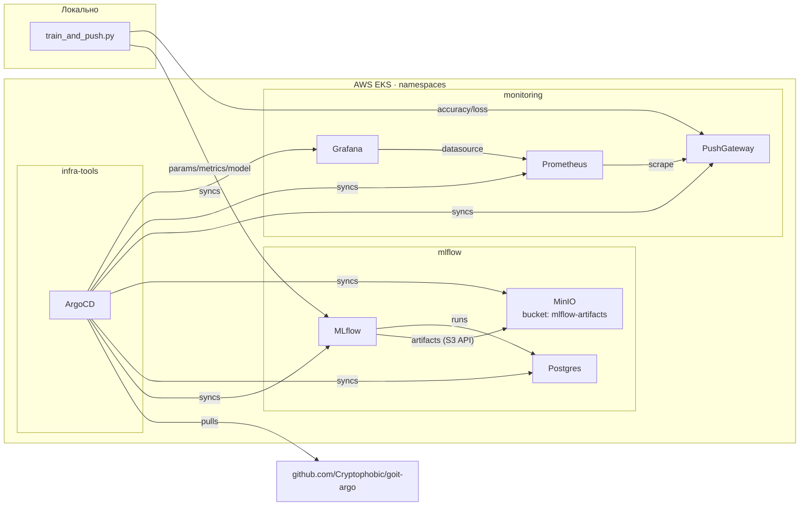

# ML-OPS-CI-CD-classes — lesson-8-9

MLflow + MinIO + Postgres + Prometheus PushGateway + Grafana розгортаються в EKS
**декларативно через ArgoCD**. Python-скрипт `experiments/train_and_push.py`
тренує сітку моделей на Iris, логує параметри/метрики/артефакти в MLflow і
пушить `accuracy`/`loss` у PushGateway з мітками `run_id`. Найкращу модель
автоматично копіює в `best_model/`.

GitOps-джерело: <https://github.com/Cryptophobic/goit-argo>

## Архітектура



## Структура проєкту

```
.
├── README.md
├── TASK.md
├── argocd/
│   ├── root-app.yaml                 # App-of-Apps, дзеркало з goit-argo
│   └── applications/                 # дзеркало 5 Application з goit-argo
├── experiments/
│   ├── train_and_push.py
│   └── requirements.txt
├── best_model/                       # заповнюється після успішного запуску
├── eks/                              # Terraform-модуль EKS
├── vpc/                              # Terraform-модуль VPC
├── terraform/argocd/                 # Terraform-шар: ArgoCD helm_release
├── main.tf · variables.tf · outputs.tf · backend.tf · terraform.tf
└── .gitignore
```

## Pre-req

| Tool       | Версія, з якою тестувалося |
|------------|---------------------------|
| Terraform  | 1.15.3                    |
| AWS CLI    | 2.x з налаштованим `aws sts get-caller-identity` |
| kubectl    | 1.31+                     |
| Helm CLI   | 3.x (не обовʼязково — ArgoCD сам тягне чарти) |
| Python     | 3.11+                     |

## 1. Підняти інфраструктуру

```bash
# 1.1 VPC + EKS (~15 хв)
terraform init
terraform apply -auto-approve

# 1.2 Оновити kubeconfig
aws eks update-kubeconfig --region eu-central-1 --name mlops-eks-cluster
kubectl get nodes

# 1.3 ArgoCD у namespace infra-tools (~3-5 хв)
terraform -chdir=terraform/argocd init
terraform -chdir=terraform/argocd apply -auto-approve

# 1.4 Зареєструвати App-of-Apps (читає apps/ із goit-argo)
kubectl apply -n infra-tools -f argocd/root-app.yaml
```

ArgoCD далі сам створить 5 дочірніх Application:

```bash
kubectl get applications -n infra-tools
# NAME                    SYNC STATUS   HEALTH STATUS
# root                    Synced        Healthy
# postgres                Synced        Healthy
# minio                   Synced        Healthy
# mlflow                  Synced        Healthy
# pushgateway             Synced        Healthy
# kube-prometheus-stack   Synced        Healthy
```

## 2. Перевірити поди

```bash
kubectl get pods -n mlflow
kubectl get pods -n monitoring
```

## 3. Port-forward

```bash
# MLflow UI
kubectl port-forward -n mlflow svc/mlflow 5000:5000

# MinIO console
kubectl port-forward -n mlflow svc/minio-console 9001:9001

# PushGateway
kubectl port-forward -n monitoring svc/prometheus-pushgateway 9091:9091

# Grafana
kubectl port-forward -n monitoring svc/kube-prometheus-stack-grafana 3000:80

# ArgoCD UI (бонус)
kubectl port-forward -n infra-tools svc/argocd-server 8080:80
```

## 4. Запуск експериментів

```bash
python -m venv .venv
source .venv/bin/activate
pip install -r experiments/requirements.txt

export MLFLOW_TRACKING_URI=http://localhost:5000
export MLFLOW_S3_ENDPOINT_URL=http://localhost:9000
export AWS_ACCESS_KEY_ID=mlflow
export AWS_SECRET_ACCESS_KEY=mlflow-secret-key
export AWS_DEFAULT_REGION=us-east-1
export PUSHGATEWAY_URL=http://localhost:9091

# додатково підняти MinIO API:
kubectl port-forward -n mlflow svc/minio 9000:9000 &

python experiments/train_and_push.py
```

Скрипт прокидає 5 пар `(learning_rate, epochs)`, логує:
- `mlflow.log_params(...)` — `learning_rate_init`, `epochs`
- `mlflow.log_metric(...)` — `accuracy`, `loss`
- `mlflow.sklearn.log_model(...)` — модель (артефакти кладуться в MinIO)
- `prometheus_client.push_to_gateway(...)` — `mlflow_accuracy`, `mlflow_loss`
  з міткою `run_id`

Після цього найкращий run копіюється в `best_model/`.

## 5. Подивитись метрики в Grafana

1. `kubectl port-forward -n monitoring svc/kube-prometheus-stack-grafana 3000:80`
2. <http://localhost:3000> → логін: `admin` / пароль: `admin`
3. **Explore** → datasource **Prometheus** → запит:
   ```
   mlflow_accuracy
   mlflow_loss
   ```
4. Або готовий PromQL для порівняння run-ів:
   ```
   topk(1, mlflow_accuracy)
   ```

## 6. Знести інфру після перевірки

```bash
terraform -chdir=terraform/argocd destroy -auto-approve
terraform destroy -auto-approve
```

## Скріншоти

### ArgoCD — 6 Applications Synced/Healthy


### MLflow — 5 run'ів `iris-sgd-grid`


### MinIO — bucket `mlflow-artifacts` із артефактами моделей


### Grafana → Explore → PromQL `mlflow_accuracy`


### Grafana → Explore → PromQL `mlflow_loss`


## Логи виконання (proof)

Реальні CLI-виводи з прогону — у файлі [`PROOF.md`](PROOF.md).