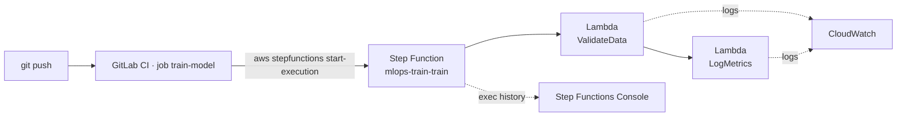

# ML-OPS-CI-CD-classes — lesson-10

Автоматизоване тренування ML-моделей через **AWS Step Functions + Lambda**,
розгорнуте Terraform-ом і запущене з **GitLab CI** на кожен push у `main`.

## Архітектура



## Структура проєкту

```
.
├── README.md
├── TASK.md
├── .gitlab-ci.yml
└── terraform/
    ├── main.tf
    ├── variables.tf
    ├── outputs.tf
    ├── backend.tf
    └── lambda/
        ├── validate.py
        ├── log_metrics.py
        ├── validate.zip            # збирається `terraform plan`-ом автоматично
        └── log_metrics.zip
```

## Pre-req

| Tool      | Версія, з якою тестувалося |
|-----------|---------------------------|
| Terraform | 1.15.3                    |
| AWS CLI   | 2.x з `aws sts get-caller-identity` ОК |
| Python    | будь-яка 3.x (для перевірки локально) |
| `zip`     | системний                 |

## 1. Зібрати Lambda-архіви

Terraform-провайдер `archive` робить це автоматично під час `plan`/`apply`,
але вручну це теж можна:

```bash
cd terraform/lambda
zip -j validate.zip validate.py
zip -j log_metrics.zip log_metrics.py
cd ../..
```

## 2. Розгорнути інфру через Terraform

```bash
cd terraform
terraform init
terraform apply -auto-approve
```

На виході отримаєте outputs — найважливіший `state_machine_arn`:

```bash
terraform output state_machine_arn
# arn:aws:states:eu-central-1:<acc-id>:stateMachine:mlops-train-train
```

10 ресурсів: 2 IAM-ролі, 1 IAM-policy, 1 IAM-policy-attachment, 2 Lambda,
3 CloudWatch log-групи, 1 Step Function.

## 3. Запустити Step Function вручну

```bash
terraform output -raw manual_start_command | bash

# або своїм payload-ом:
aws stepfunctions start-execution \
  --region eu-central-1 \
  --state-machine-arn "$(terraform output -raw state_machine_arn)" \
  --name "manual-$(date +%s)" \
  --input '{"source":"manual","commit":"local-test","rows":1500,"epochs":100,"learning_rate":0.01}'
```

Перевірити статус:

```bash
aws stepfunctions list-executions --region eu-central-1 \
  --state-machine-arn "$(terraform output -raw state_machine_arn)" \
  --max-items 5
```

Або у **AWS Console → Step Functions → mlops-train-train → Executions**.

## 4. Приклад payload-у через CI

```json
{
  "source": "gitlab-ci",
  "commit": "abc1234",
  "branch": "main",
  "pipeline_id": "12345",
  "rows": 1500,
  "epochs": 100,
  "learning_rate": 0.01
}
```

Що відбувається:
1. **ValidateData** перевіряє наявність `source`/`commit`, рахує
   `bad_rows/rows_scanned` (для демо bad_rows=0). Кидає `ValueError` якщо
   `bad_ratio > 5%` — Step Function робить retry до 2 разів.
2. **LogMetrics** генерує детерміновані accuracy/loss (seed=`commit`),
   повертає payload зі статусом `succeeded`.

## 5. GitLab CI

### 5.1. Створіть проєкт на gitlab.com

- New project → Create blank project → Project URL `cryptophobic/mlops-train-automation`
  (приватний).

### 5.2. Додайте CI/CD variables

**Settings → CI/CD → Variables** (всі — `Protected`, перші дві — `Masked`):

| Key                       | Value                                                  |
|---------------------------|--------------------------------------------------------|
| `AWS_ACCESS_KEY_ID`       | ваш AKIA…                                              |
| `AWS_SECRET_ACCESS_KEY`   | secret                                                 |
| `AWS_DEFAULT_REGION`      | `eu-central-1`                                         |
| `STATE_MACHINE_ARN`       | вивід `terraform output -raw state_machine_arn`         |

### 5.3. Додайте GitLab як remote і запушіть `lesson-10`

```bash
git remote add gitlab git@gitlab.com:cryptophobic/mlops-train-automation.git
git push -u gitlab lesson-10
```

Pipeline у GitLab побіжить автоматично при push у `main`. Для тесту з гілки
запустіть **Build → Pipelines → Run pipeline** (rule `$CI_PIPELINE_SOURCE == "web"`).

### 5.4. Що робить job `train-model`

- Стартує AWS CLI у Docker `amazon/aws-cli:2.15.0`.
- Формує JSON payload зі змінних GitLab (`$CI_COMMIT_SHORT_SHA`, etc.).
- Викликає `aws stepfunctions start-execution` з `--input "$INPUT"`.
- Робить polling до `SUCCEEDED`/`FAILED` (≤ 3 хв).
- Fail-ить pipeline, якщо Step Function закінчився `FAILED|TIMED_OUT|ABORTED`.

## 6. Зачистити інфру

```bash
cd terraform
terraform destroy -auto-approve
```

## Скріншоти

### Step Functions Console — три SUCCEEDED execution


### Граф ValidateData → LogMetrics


### CloudWatch — лог Lambda `validate`


### GitLab CI — успішний pipeline `train-model`


## Логи виконання (proof)

Реальні CLI-виводи — у файлі [`PROOF.md`](PROOF.md).